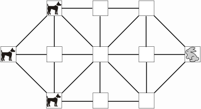

# HareGame
This is a web-based variant of the classic strategy board game [hare](https://en.wikipedia.org/wiki/Hare_games).
This is a two player board game where the hounds try to trap a hare as it attempts to escape beyond them.

## Game Board Appearance When Game Starts

## Summary of the Rules
* The game is turn based with the hound moving first.
* The player with the turn can only move one of his pieces per turn. A piece can only move one step at a time and it can only move to an empty location connected to its current location.
* Hounds cannot move backwards while the hare has no such restriction.
* The game continues until one of the following conditions occur:
   1. The hare is trapped such that it has no valid move. The hounds win in this case.
   2. The hare manages to sneak past the hounds. i.e. it moves to a square such that there are no hounds to left of it. In this case the hare wins.
   3. The same board appearance occurs three times over the course of the game. In this case the hounds are considered to be stalling and the hare wins.
